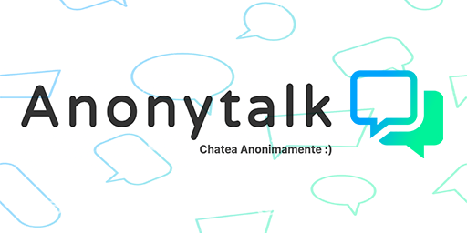

# Anonytalk Chat

<a href="https://anonytalk.netlify.app" ></a>

### Anonytalk es una pagina de Chat anonimo grupal, ingresa tu nombre y la id del grupo de tu chat y empeza a chatear!.


## Desarrollado con 


## Tecnologias

- ### Socket.io Client
- ### React Linkify

## Funcionalidades

- #### Chatea sin registro.
- #### Contador de usuarios de cada Grupo
- #### Diseño Adaptativo para cualquier plataforma.

## Instalación

- ### Requiere Anonytalk_Server para funcionar

```sh
cd anonytalk_web
npm i
npm run dev
```